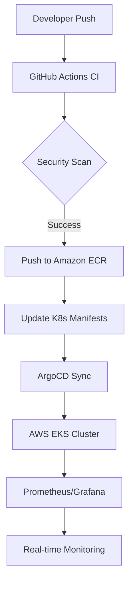

# 🛒 DevSecOps E-Commerce Cloud Ecosystem
**A Production-Ready, Automated, and Observable Cloud-Native Environment on AWS EKS.**

---

## 🌟 Executive Summary
This project demonstrates a comprehensive **End-to-End DevSecOps Lifecycle**. I have transformed a full-stack e-commerce application into a highly scalable, secure, and observable cloud ecosystem on **Amazon Web Services (AWS)**. By integrating **Infrastructure as Code (Terraform)**, **GitOps (ArgoCD)**, and **Observability (Prometheus/Grafana)**, I have built a system that follows the industry's best practices for modern software delivery.

---

## 🛡️ The DevSecOps Pillars

### 1. Infrastructure as Code (IaC) 🏗️
*   **Provisioning**: Used **Terraform** to automate the creation of a custom VPC, Subnets, and an **Amazon EKS (1.34)** cluster.
*   **Scalability**: Configured a dynamic 3-node managed node group to ensure high availability and resource efficiency.
*   **Automation**: Infrastructure can be built or destroyed with a single command, ensuring zero manual configuration drift.

### 2. The Security Fortress 🛡️
*   **Scanning**: Integrated **Trivy** for container image vulnerability scanning and **Gitleaks** to prevent secret exposure.
*   **Hardening**: Implemented non-root user execution in Docker and Kubernetes security contexts.
*   **Compliance**: Automated security gates in the CI pipeline ensure only "Clean" code reaches production.

### 3. GitOps & CI/CD Automation 🦊⚙️
*   **CI Pipeline**: Built with **GitHub Actions** to automate Docker builds, tagging, and pushing to **Amazon ECR**.
*   **GitOps Delivery**: Used **ArgoCD** as the "Single Source of Truth." The cluster automatically synchronizes with the GitHub repository, enabling seamless, zero-downtime updates.

### 4. Real-Time Observability 📊🔍
*   **Metrics**: Deployed the **Prometheus & Grafana** stack to track cluster performance.
*   **Dashboards**: Real-time visibility into CPU usage, RAM pressure, and server health across the entire AWS infrastructure.

---

## 🛠️ Technical Stack

---

## 🚀 Getting Started

### Prerequisites
*   AWS Account & CLI configured
*   Terraform installed
*   Kubectl installed

### Deployment Steps
1.  **Infrastructure**: `cd terraform && terraform init && terraform apply`
2.  **App Deployment**: ArgoCD will automatically pick up the manifests in `/k8s`.
3.  **Monitoring**: Install the Prometheus stack via Helm or ArgoCD as described in our documentation.

---

## 📐 Architecture Diagram

---

## 💖 Special Acknowledgment
A heartful thanks to **Vishakha Sadhwani** ( [LinkedIn](https://www.linkedin.com/in/vsadhwani/) ) for her invaluable guidance, support, and mentorship throughout this project. This journey would not have been the same without her expertise!

---

## 🏆 Project Status: Complete & Production-Ready
This project is an end-to-end implementation of a modern cloud-native workflow. It is built to be secure, automated, and observable.

**Created with ❤️ by Dipak Shimpi**
